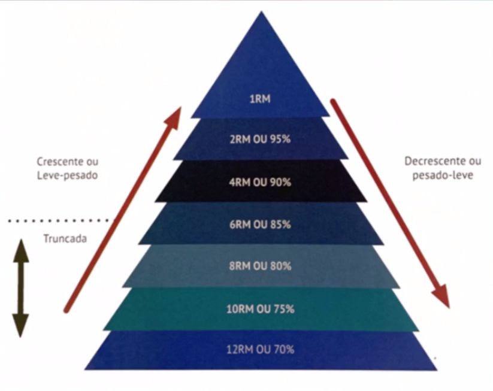
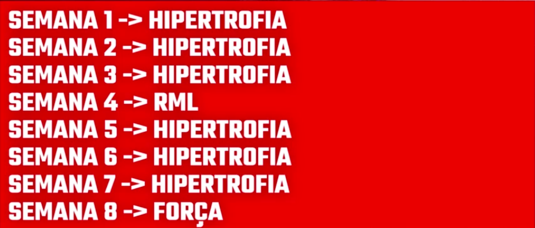

# 💪🏽 Rotina-Treino ✌🏽


# 👉🏽 Destaques 👈🏽
- [Rodar a Aplicação](#gostaria-de-rodar-em-sua-máquina-e-acompanhar-os-treinos-siga-o-tutorial)
- [Desenvolvimento do Site](#desenvolvimento-do-site)
- [Sites Usados](#site-usados-me-apoiar-no-desenvolvimento)
- [Tecnologias Usadas](#tecnologias-usadas)
- [Conceitos Básicos](#conceitos-básicos)
- [Material Didático](#material-didático-utilizado)


# Gostaria de rodar em sua máquina e acompanhar os treinos? Siga o tutorial:


- Antes de tudo é necessário que você instale Docker, clique abaixo para prosseguir com a instalação da ferramenta:


<a href="https://docs.docker.com/engine/install/">Docker 🐳</a>


$ ```docker build -t treino .```


$ ```docker run -d -p 8080:80 --name treino treino```


- E assim a instalação do projeto será concluída, agora basta acessar o <a href="http://localhost:8080">Local Host</a> na porta 8080  🏋🏻‍♂️


# Desenvolvimento do Site


- Assim como pode observar eu tentei utilizar do puro HTML & CSS para o desenvolvimento do site, tanto para aprofundar meu conhecimento em front-end e relembrar alguns conceitos até então esquecidos.
 
- Logo juntei o útil com o agradável, estava querendo voltar a me exercitar fisicamente e então decidi criar esta Rotina de Treino.
 
- Decidi portanto, logo após o funcionamento e conclusão do site, conteirizar o mesmo pelo Docker.


- Ainda estou desenvolvendo mais algumas funcionalidades, otimizando e embelezando ainda mais, como por exemplo uma responsividade futura, porém ainda assim da forma que esta, atende as minhas necessidades.

- Responsividade feita, está rodando perfeitamente no meu celular, pode ser que em alguns dispositivos ainda esteja um tanto quanto mal otimizado, mas assim que possível estarei ajustanto e melhorando.

- Futuramente pretendo facilitar o acesso aos celulares, pois no momento é necessário o código base estar em alguma pasta do celular e rodar com IDE Mobiles.


# Site usados me apoiar no desenvolvimento: 


<a href="https://fontawesome.com">Font Awesome</a>


<a href="https://www.colorhexa.com">Color Hexa</a>


<a href="https://br.pinterest.com">Pinterest</a>


<a href="https://fonts.google.com">Google Fonts</a>


<a href="https://colorhunt.co">Color Hunt</a>


<a href="https://fitnessprogramer.com">Fitness Programer</a>


# Tecnologias Usadas


# Conceitos Básicos:

## Variáveis de Treinamento:

### Frequência:

- Quantidade de vezes que irei treinar determinado musculo na semana.

### Densidade:

- Tensão do exercício durante sua execução.
- Tempo de descanso durante as séries dos treinos.
- Repetições em cada série.
- Densidade é inversamente proporcional a intensidade, aumento de carga e tempo de descanso curto.
- Cadência lenta aumenta a densidade.

### Intensidade:

- Peso do exercicio.
- Volume inversamente proporcional a intensidade.
  - Caso aumente a quantidade de séries e repetições, a carga irá diminuir.

### German Volume Training (GVT):
- 60 segundos musculos pequenos e a 90 segundos para musculos grandes.
- Mesma carga durante as 10 repetições.
  - Podendo ser adaptado.
  
### FST-7 (Treinamento de Alongamento da Fascia):

- No final do treinamento de um agrupamento de músculos irá executar 7 séries de 8 a 12 repetições, em exercicio isolador.
- 30 segundos de descanso ativo.
  - Alongamento durante o descanso.
- Ajuda em musculos encurtados durante as séries.

### Cálculo de RM (Repetição Máxima):



Este <a href="https://miniwebtool.com/br/one-rep-max-1rm-calculator/?weight_lifted=60&kg_lb=kg&number_of_repetitions=10">link</a> irá calcular o número de repetições máximas e suas devidas porcentagem.

<strong>

### Exercicios para calcular seu RM:

- Supino
- Agachamento Livre
- Levantamento Terra
</strong>

Estarei utilizando a Periodização de Treino para assim alcançar ainda mais rápidos meu objetivos e irá seguir da seguinte forma:


##### OBS: Os treinos estão divididos na Aba treinos.


<table>
    <tr>
    <th>Ordem</th>
    <th>Duração</th>
    <th>Tipo de Treino</th>
  </tr>
  <tr>
    <td>1°</td>
    <td>1 - 2 Semanas</td>
    <td>Adaptação (2x AB)</td>
  </tr>
  <tr>
    <td>2°</td>
    <td>4 - 8 Semanas</td>
    <td>Hipertrofia (ABCD)</td>
  </tr>
  <tr>
    <td>3°</td>
    <td>1 Semana</td>
    <td>Força / Choque</td>
  </tr>
  <tr>
    <td>4°</td>
    <td>1 Semana</td>
    <td>RML - Resistencia Muscular Localizada (ABCD)</td>
  </tr>
  <tr>
    <td>4° / 5°</td>
    <td>1 Semana</td>
    <td>Deload (ABCD)</td>
  </tr>
</table>

<br>



<br>

- Treinos de Adaptação não são até a falhas e sim, compreender a execução dos exercícios. (Aprendizado Neuromotor).
- Treinos RML são com pesos menores, como por exemplo uma semana de descanso e ainda assim executando e ativando as enzimas. (Aumenta a densidade do Treino)

<details>
  <summary> Treino de Adaptação</summary>
  <code>Em meu ciclo de treinos a adaptação é logo após um periodo de Deload, irei explicar posteriormente ou você pode clicar logo abaixo. Basicamente como o próprio nome insinua é um treino adaptativo onde busca você se acostumar para a nova leva de treinos de Hipertrofia, são treinos com cargas medianas e um número de repetição e séries inferior a Hipertrofia e maior que o Treino de choque.
  Lembrando que eles trabalham mais vezes os músculos na semana, novamente acostumando/adaptando seu corpo para o ciclo de Hipertrofia</code>
</details>
<br>
<details>
  <summary> Treino de Hipertrofia</summary>
  <code>O treino de Hipertrofia dura 4 semanas, treinos rasoavelmente pesados e com progressão de carga constante, anotando cada peso e repetições até a falha, pois estou treinando em casa e alguns treinos como o de perna não tenho aparelho necessários, portanto os treinos de Coxa/Pernas são até a falha.</code>
</details>
<br>
<details>
  <summary> Treino de Choque/Força</summary>
  <code>Um semana inteira de treino buscando a força máxima e aumentando em no mínimo 10% da carga que utilizei na última semana de Hipertrofia, são poucas repetições e 5x, essa semana busca o corpo responder aos grande estímulos de força, para aumentar nossa resistencia e progessão de carga.</code>
</details>
<br>
<details>
  <summary> Treino de Deload</summary>
  <code>É uma semana de treino logo após a semana de de Choque/Força, onde busca recuperar as articulações e tendões se exercitando ainda, porém com cargas menores, em torno de 15% menor do que a última carga da semana de Hipertrofia e com altas repetições</code>
</details>
<br>
<details>
  <summary> Treino de RML</summary>
  <code>São treino optativos, caso você tenha a consciencia que alcançou seus objetivos e precisa melhorar algum músculo ou fortificar o mesmo, normalmente ele é feito após a semana de Deload, mas como ainda estou longe do meu objetivo ainda não irei utilizar a técnica RML.
  Descansos de 30 a 45 segundos</code>
</details>
<br>

## Macrociclo, Mesociclo & Microciclo

### Microciclo
- Equivaler a até 14 dias (2 semanas)
  
### Mesociclo
- Até 2 Meses

### Macrociclo
- De 6 a 12 meses
 
# Material Didático Utilizado:


### ASHMORE, A. Timing Resistance Training. [s.l.] Human Kinetics, 2019.


### AMIRTHALINGAM, T. et al. Effects of a Modified German Volume Training Program on Muscular Hypertrophy and Strength. Journal of Strength and Conditioning Research, v. 31, n. 11, p. 3109–3119, nov. 2017.


### NORONHA, F. Efeitos agudos do novo método sarcoplasma stimulating training versus treinamento de força tradicional sobre o volume total de treinamento, lactato e espessura muscular. Bdtd.ucb.br, 2019.


### AZEVEDO, P. T. DE. Comparação entre o método FST-7 e o método tradicional de treinamento de força sobre a percepção subjetiva do esforço e o volume máximo de exercício até a fadiga. www.monografias.ufop.br, 2019.


# 👷 Coming soon 👷


‌


‌


‌


